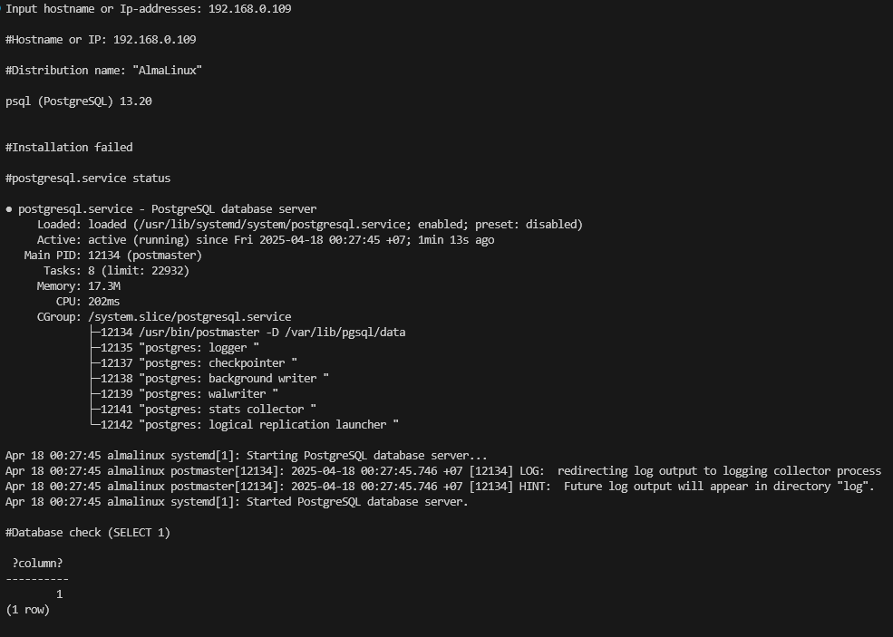
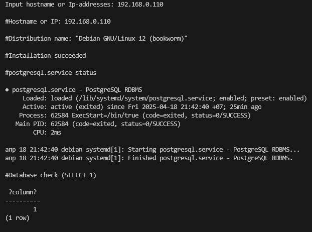

Для работы программы необходимо скачать архив из гит-репозитория по ссылке: https://github.com/ShapovalSergey/test_project
и распаковать его. 
Требуется наличие python. Далее необходимо в терминале в папке проекта написать команду 'pip install -r .\requirements.txt'
Запустить проект командной 'py .\main.py'
Далее всё в соответствии с заданием

Примеры работы:
1) Успешное выполнение на almalinux
 
2) Ошибка инсталяции (как пример debian)
 
3) Успешное выполнение на debian

В процессе выполнения возникли следующие вопросы:

1. Основной проблемой была интерпретация задания (параллельное использование слов "сервер" и "удаленный хост". Второе было интерпретировано как некая пользовательская система)
Решение - чтение задания на протяжение пары недель (прокрастинация), вдумчивое, пословное прочтение задания
2. Настройка debian сервера для подключения по ssh используя ключ
Решение - чтение документации 
3. Выбор средства внесения изменений в файл конфигурации. Изначальной идеей было использование "программистского" подхода (максимальное использование возможностей ЯП высокого уровня) - чтение файла, запись в переменную, разбиение на строки, итерация по массиву строк, поиск нужной строки, замена информации нужной строки на другую, в конце - запись в файл средствами shell комманды. Такой подход потерпел крах, связанный с функциональностью кавычек...
Решение - чтение документации, изучение опыта других проектов (StackOverflow). В итоге была обнаружена и использована команда sed, которая просто и элегантно справилась с поставленной задачей
